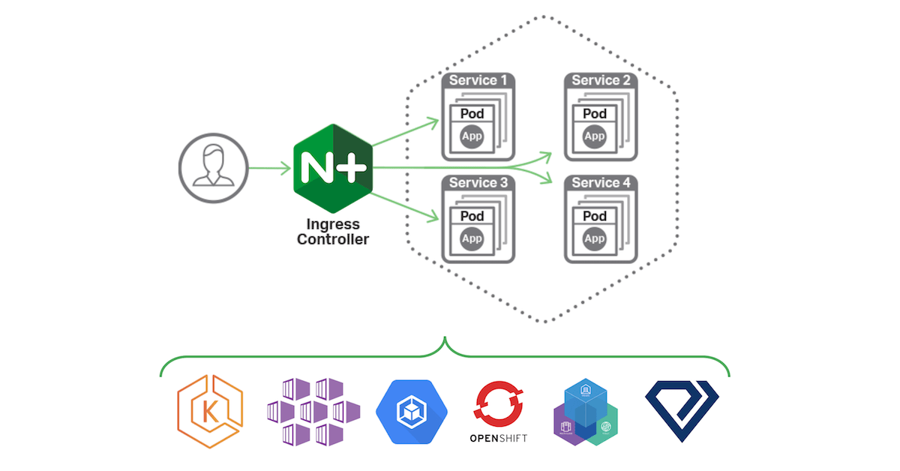
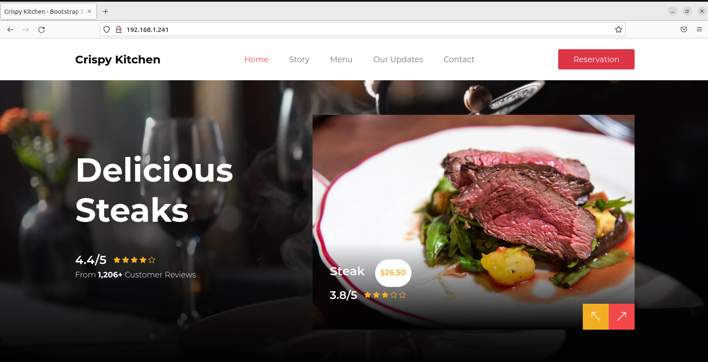

# Ingress in bare metal Kubernetes cluster
You are working in enterprise that have one cluster with one public IP address and one Domain Name. In our Example `justk8s.k8s`.
That Enterprise want to deploy two web apps for these new service (gym and restaurant) with that single cluster,IP and Domain Name !!
Your task is to deploy these two apps! So you decide to use `Ingress` because it's the best solution for this kind of problems!

## What is Ingress
Kubernetes Ingress is an API object that provides routing rules to manage external users' access to the services in a Kubernetes cluster, typically via HTTPS/HTTP. With Ingress, you can easily set up rules for routing traffic without creating a bunch of Load Balancers or exposing each service on the node


## Ingress Controller
An Ingress Controller is a Kubernetes controller that is deployed manually to the cluster, most often as a DaemonSet or a Deployment object that runs dedicated Pods for handling incoming traffic load balancing and smart routing. It is responsible for processing the Ingress objects (which specify that they especially want to use the Ingress Controller) and dynamically configuring real routing rules 
The most common used Ingress controllerfor Kubernetes is `Ingress Nginx`

## Ingress in cloud Vs Ingress in bare metal cluster
Deploying Ingress pn managed Kubernetes cluster provided in cloud easier than in bare metal cluster. Because the Ingress Controller must be exposed as LoadBlancer! 

In traditional cloud environments, where network load balancers are available on-demand, a single Kubernetes manifest suffices to provide a single point of contact to the NGINX Ingress controller to external clients and, indirectly, to any application running inside the cluster.
 
 

Bare-metal environments lack this commodity, requiring a slightly different setup to offer the same kind of access to external consumers. So we need an aproach to solve this problem !


## Create Load Balancer / Proxy for bare metal cluster
There is a lot of method to set up a Load Balancer or Proxy to get Ingress work on our cluster.
- We can expose our ingress controller using NodePort service and set up a proxy that forward to this service using a nginx proxy or HA proxy
- We can also install a software solution called `metalLB`. This solution allows to create Load Balancer in local cluster without any problem ! So we can expose our ingress controller using Load Balancer service like in the cloud environment!
### Create Load Balancer using metalLB:
In this demo we will deploy one of the 2 apps and expose it with Load Balancer service for the test purposes. So Let's start deploying the restaurant app and expose it ! 

``` yaml
apiVersion: apps/v1
kind: Deployment
metadata:
  name: justk8s-kitchen
spec:
  replicas: 1
  selector:
    matchLabels:
      app: kitchen
  template:
    metadata:
      labels:
        app: kitchen
    spec:
      containers:
      - name: kitchen-app
        image: mohamedrafraf/k8s-kitchen
        ports:
        - containerPort: 80
```
Create the gym app deployment
``` bash 
justk8s@justk8s-master$ kubectl apply -f kitchen-deployment.yaml
deployment.apps/justk8s-kitchen created

justk8s@justk8s-master$ kubectl get all
NAME                                   READY   STATUS    RESTARTS   AGE
pod/justk8s-kitchen-698f44db99-29dnr   1/1     Running   0          63s
```
Let's now expose now the deployment:
``` bash
justk8s@justk8s-master$ kubectl expose deploy/justk8s-kitchen--type=LoadBalacner --port=80
service/justk8s-kitchen created
```
Let's check this service
``` bash 
justk8s@justk8s-master$ kubectl get svc
NAME              TYPE           CLUSTER-IP       EXTERNAL-IP     PORT(S)        AGE
justk8s-kitchen   LoadBalancer   10.97.71.78      <pending>       80:30918/TCP   21s
kubernetes        ClusterIP      10.96.0.1        <none>          443/TCP        5d11h
```
As we see the LoadBalancer service still pending since we don't have any Load Balancer! Now it's time to talk about the metalLB !

MetalLB provides a network load-balancer implementation for Kubernetes clusters that do not run on a supported cloud provider, effectively allowing the usage of LoadBalancer Services within any cluster.


It's time to install metalLB. Installing metalLB is so easy we just need to apply two manifest from the official site of [metalLB](https://metallb.universe.tf/installation/)
``` bash
kubectl apply -f https://raw.githubusercontent.com/metallb/metallb/v0.12.1/manifests/namespace.yaml
kubectl apply -f https://raw.githubusercontent.com/metallb/metallb/v0.12.1/manifests/metallb.yaml
```
After running the previous commands, a new namespace will be created with a deployment, daesmonset and lot of RBAC authorization and rules!. So let's check this namespace!
``` bash 
justk8s@justk8s-master$ kubectl get all -n metallb-system
NAME                              READY   STATUS    RESTARTS       AGE
pod/controller-7cf77c64fb-4b8sx   1/1     Running   0              23s
pod/speaker-chh2t                 1/1     Running   0              23s
pod/speaker-xbn8z                 1/1     Running   0              23s

NAME                     DESIRED   CURRENT   READY   UP-TO-DATE   AVAILABLE   NODE SELECTOR            AGE
daemonset.apps/speaker   2         2         2       2            2           kubernetes.io/os=linux   23s

NAME                         READY   UP-TO-DATE   AVAILABLE   AGE
deployment.apps/controller   1/1     1            1           23s

NAME                                    DESIRED   CURRENT   READY   AGE
replicaset.apps/controller-7cf77c64fb   1         1         1       23s
```
Now we must configure the `metalLB` using configmap object. In this configmap we give the address pool that will be used as LoadBalancer IP! Also the type of the Load Balancer.
> metalLB supports two LoadBalancing modes : Layer 2 mode and BGP mode. In our case we will use the Layer 2 mode

Now Let's move to the configmap manifest!
``` yaml 
apiVersion: v1
kind: ConfigMap
metadata:
  namespace: metallb-system
  name: config
data:
  config: |
    address-pools:
    - name: default
      protocol: layer2
      addresses:
      - 192.168.1.240-192.168.1.250
```
After Applying this recent configmap. we can say that the metalLB installtion is finished! So Let's check the services again in our cluster !

``` bash 
justk8s@justk8s-master$ kubectl get svc
NAME              TYPE           CLUSTER-IP       EXTERNAL-IP     PORT(S)        AGE
justk8s-kitchen   LoadBalancer   10.97.71.78      192.168.1.241   80:30918/TCP   5m4s
kubernetes        ClusterIP      10.96.0.1        <none>          443/TCP        5d11h
```
Bingo! our Load Balancer service has an external IP address. So our deployment is accessable through this IP! Let's check it:
ٍ
Everything is OK! now we can say that we have a Load Balancer on our bare metal cluster!
## Install the nginx Ingress Controller:
Installing the nginx ingress controller can be done either by using Helm or the yaml manifest provided in the nginx controller website
### Install the controller using Helm 
If you have Helm, you can deploy the ingress controller with the following command:
``` bash 
justk8s@justk8s-master$ helm upgrade --install ingress-nginx ingress-nginx \
  --repo https://kubernetes.github.io/ingress-nginx \
  --namespace ingress-nginx --create-namespace
```
### Install the controller using yaml manifest:
If you don't have Helm or if you prefer to use a YAML manifest, you can run the following command instead:
``` bash 
justk8s@justk8s-master$ kubectl apply -f https://raw.githubusercontent.com/kubernetes/ingress-nginx/controller-v1.2.0/deploy/static/provider/cloud/deploy.yaml

namespace/ingress-nginx created
serviceaccount/ingress-nginx created
serviceaccount/ingress-nginx-admission created
role.rbac.authorization.k8s.io/ingress-nginx created
role.rbac.authorization.k8s.io/ingress-nginx-admission created
clusterrole.rbac.authorization.k8s.io/ingress-nginx created
clusterrole.rbac.authorization.k8s.io/ingress-nginx-admission created
rolebinding.rbac.authorization.k8s.io/ingress-nginx created
rolebinding.rbac.authorization.k8s.io/ingress-nginx-admission created
clusterrolebinding.rbac.authorization.k8s.io/ingress-nginx created
clusterrolebinding.rbac.authorization.k8s.io/ingress-nginx-admission created
configmap/ingress-nginx-controller created
service/ingress-nginx-controller created
service/ingress-nginx-controller-admission created
deployment.apps/ingress-nginx-controller created
job.batch/ingress-nginx-admission-create created
job.batch/ingress-nginx-admission-patch created
ingressclass.networking.k8s.io/nginx created
validatingwebhookconfiguration.admissionregistration.k8s.io/ingress-nginx-admission created
```
### Check the Nginx Ingress Controller:
Let's check the pods created in the namespace of the ingress-nginx
``` bash 
justk8s@justk8s-master$ kubectl get pods --namespace=ingress-nginx

NAME                                        READY   STATUS              RESTARTS   AGE
ingress-nginx-admission-create-qd8fz        0/1     ContainerCreating   0          10s
ingress-nginx-admission-patch-76lgl         0/1     ContainerCreating   0          10s
ingress-nginx-controller-7575567f98-hg6tq   0/1     ContainerCreating   0          10s
```
After waiting a few minute until the controller is ready, we must check all the services and deployments of the ingress-nginx namespace again ! You must find an output similar to the following
``` bash 
justk8s@justk8s-master$ kubectl get all -n ingress-nginx

NAME                                            READY   STATUS      RESTARTS        AGE
pod/ingress-nginx-admission-create-9dshm        0/1     Completed   0               23m
pod/ingress-nginx-admission-patch-rj7gk         0/1     Completed   0               23m
pod/ingress-nginx-controller-7575567f98-8w6pm   1/1     Running     0               23m

NAME                                         TYPE           CLUSTER-IP       EXTERNAL-IP     PORT(S)                      AGE
service/ingress-nginx-controller             LoadBalancer   10.100.234.221   192.168.1.240   80:32545/TCP,443:31214/TCP   23m
service/ingress-nginx-controller-admission   ClusterIP      10.109.162.157   <none>          443/TCP                      23m

NAME                                       READY   UP-TO-DATE   AVAILABLE   AGE
deployment.apps/ingress-nginx-controller   1/1     1            1           23m

NAME                                                  DESIRED   CURRENT   READY   AGE
replicaset.apps/ingress-nginx-controller-7575567f98   1         1         1       23m

NAME                                       COMPLETIONS   DURATION   AGE
job.batch/ingress-nginx-admission-create   1/1           3s         23m
job.batch/ingress-nginx-admission-patch    1/1           4s         23m
```
Bingo! the ingress controller is ready and on running state! also is exposed with Load Balancer and it have a Extenal-IP `192.168.1.240`
Now we can deploy an ingress object without any problem ! It's time to deploy our 2 apps with ingress in one single domain name and one IP address !

## Deploy The two Apps using Ingress:
Let's start by deploying the apps and expose it with Cluster IP service !

``` yaml
apiVersion: apps/v1
kind: Deployment
metadata:
  name: justk8s-gym
spec:
  replicas: 1
  selector:
    matchLabels:
      app: gym
  template:
    metadata:
      labels:
        app: gym
    spec:
      containers:
      - name: gym-app
        image: mohamedrafraf/k8s-gym
        ports:
        - containerPort: 80
---
apiVersion: v1
kind: Service
metadata:
  name: gym-svc
spec:
  selector:
    app: gym
  type: ClusterIP
  ports:
  - protocol: TCP
    port: 80
```
Create the deployment and service of the gym app
``` bash 
justk8s@justk8s-master$ kubectl apply -f gym-deployment.yaml
deployment.apps/justk8s-gym created
justk8s@justk8s-master$ kubectl apply -f gym-svc.yaml
service/gym-svc created
```
The manifest of the restaurant app and the service:
``` yaml   
apiVersion: apps/v1
kind: Deployment
metadata:
  name: justk8s-kitchen
spec:
  replicas: 1
  selector:
    matchLabels:
      app: kitchen
  template:
    metadata:
      labels:
        app: kitchen
    spec:
      containers:
      - name: kitchen-app
        image: mohamedrafraf/k8s-kitchen
        ports:
        - containerPort: 80
---
apiVersion: v1
kind: Service
metadata:
  name: kitchen-svc
spec:
  selector:
    app: kitchen
  type: ClusterIP
  ports:
  - protocol: TCP
    port: 80
```
Create the restaurant deployment and the service:
``` bash 
justk8s@justk8s-master$ kubectl apply -f kitchen-deployment.yaml
deployment.apps/justk8s-kitchen created
justk8s@justk8s-master$ kubectl apply -f kitchen-svc.yaml
service/kitchen-svc created
```
Check the deployments and the services! :
``` bash
justk8s@justk8s-master$ kubectl get all
NAME                                   READY   STATUS    RESTARTS   AGE
pod/justk8s-gym-698f44db99-29dnr       1/1     Running   0          63s
pod/justk8s-kitchen-6b56959b86-n7c9z   1/1     Running   0          46s

NAME                        TYPE        CLUSTER-IP       EXTERNAL-IP   PORT(S)    AGE
service/gym-svc             ClusterIP   10.110.191.206   <none>        80/TCP     53s
service/kitchen-svc         ClusterIP   10.102.94.94     <none>        80/TCP     39s
service/kubernetes          ClusterIP   10.96.0.1        <none>        443/TCP    3d14h

NAME                              READY   UP-TO-DATE   AVAILABLE   AGE
deployment.apps/justk8s-gym       1/1     1            1           63s
deployment.apps/justk8s-kitchen   1/1     1            1           46s

NAME                                         DESIRED   CURRENT   READY   AGE
replicaset.apps/justk8s-gym-698f44db99       1         1         1       63s
replicaset.apps/justk8s-kitchen-6b56959b86   1         1         1       46s
```
Let's now create the ingress manifest:
``` yaml

apiVersion: networking.k8s.io/v1
kind: Ingress
metadata:
  annotations:
    nginx.ingress.kubernetes.io/rewrite-target: /
  name: ingress-justk8s
spec:
  ingressClassName: nginx
  rules:
  - host: justk8s.k8s
    http:
      paths:
      - path: /kitchen
        pathType: Prefix
        backend:
          service:
            name: kitchen-svc
            port:
              number: 80
      - path: /gym
        pathType: Prefix
        backend:
          service:
            name: gym-svc
            port:
              number: 80
```
The `ingressClassName` must be "nginx" since we have nginx ingress controller. The `host` field in the `rules` define the domain name of the request. So if a HTTP request come to the cluster with the host name `justk8s.k8s` this rull will be applied!
The the `path` int the `paths` will be the route ! The ingress give you the service in this route!
In our Example if we enter `http://justk8s.k8s/kitchen` the ingress will forward the restaurant app!
in the `path` field we specify the `service` name and the `port number`

Now Let's Create the ingress object
``` bash
justk8s@justk8s-master$ kubectl apply -f ingress.yaml
ingress.networking.k8s.io/ingress-justk8s created
```
Check the ingerss object ! 
``` bash
justk8s@justk8s-master$ kubectl get ingress
NAME              CLASS   HOSTS         ADDRESS   PORTS   AGE
ingress-justk8s   nginx   justk8s.k8s             80      5s
``` 
Display more details about the ingress object with `kubectl describe ingress`:
``` bash
justk8s@justk8s-master$ kubectl describe ingress ingress-justk8s
Name:             ingress-justk8s
Labels:           <none>
Namespace:        default
Address:          192.168.1.240
Default backend:  default-http-backend:80 (<error: endpoints "default-http-backend" not found>)
Rules:
  Host         Path  Backends
  ----         ----  --------
  justk8s.k8s
               /kitchen   kitchen-svc:80 (10.1.235.141:80)
               /gym       gym-svc:80 (10.1.235.147:80)
Annotations:   nginx.ingress.kubernetes.io/rewrite-target: /
Events:
  Type    Reason  Age               From                      Message
  ----    ------  ----              ----                      -------
  Normal  Sync    7s (x2 over 19s)  nginx-ingress-controller  Scheduled for sync
```
We see that the Default backend display `(<error: endpoints "default-http-backend" not found>)`.
This error occur because we don't specify a default backend (route) so when you enter `http://justk8s.k8s/` we will find the nginx 404 not found page !
## Check the Deployments! 
After Installing the LoadBalancer and Ingress Controller. Let's try to access to our 2 apps. But before access to this apps let's create an `/etc/hosts` entry (`C:\Windows\System32\Drivers\etc\hosts` for Windows):
``` bash 
192.168.1.240 justk8s.k8s # The IP address of the Load Balancer of the Ingress Controller !
```
Now Let's go to our browser! I add this entry in my master node! So I can access to these apps from my master node !:


Bingo! Everything is Ok !