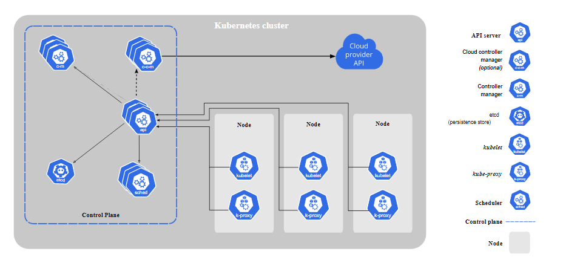

# Kubernetes Architecture
## Cluster
When you deploy Kubernetes, you get a cluster.
## Pod
A pod is a set of running containers in a cluster.
## Node
A Kubernetes cluster is composed of a set of nodes, which are physical or virtual servers that can be grouped into 2 main types: master and worker nodes.

**Master node:**  A node from the control plane, that has installed components to make global, cluster-level decisions.

**Worker node:** A node that has installed components to host workloads (pods).
Every cluster should have at least 1 worker node. 

## Control Plane Components
The container orchestration layer that exposes the API and interfaces to define, deploy, and manage the lifecycle of containers. The control plane manages the worker nodes and the pods in the cluster.
The components of the control plane are:
- **Kube-apiserver:** Exposes the Kubernetes API, and handles and triggers any operations within the cluster. 

Kube-apiserver is designed to scale horizontally—that is, it scales by deploying more instances. You can run several instances of kube-apiserver and balance traffic between those instances.
- **Kube-scheduler:**  Watches for newly created Pods with no assigned node, and selects a node for them to run on.
- **Kube-controller-manager:** Runs controller processes. A controller is a control loop that watches the shared state of the cluster through apiserver and makes changes attempting to move the current state towards the desired state.

Logically, each controller is a separate process, but to reduce complexity, they are all compiled into a single binary and run in a single process.
Some of these controllers is node controller (responsible for noticing and responding when nodes go down).
- **etcd:** Consistent and highly-available key value store used as Kubernetes' backing store for all cluster data.
# Node Components
- **Kubelet:** The agent that runs on every node and notifies the kube- apiserver that this node is part of the cluster. It makes sure that containers are running in a Pod.
- **Kube-proxy:** A network proxy that ensures the reachability and accessibility of workloads places on this specific node. 

To ensure maximum security, kube-proxy maintains network rules on nodes. These network rules allow network communication to your Pods from network sessions inside or outside of your cluster. kube-proxy uses the operating system packet filtering layer if there is one and it's available. Otherwise, kube-proxy forwards the traffic itself.

*Kubernetes official website: [Kubernetes Components](https://kubernetes.io/docs/concepts/overview/components/)*
