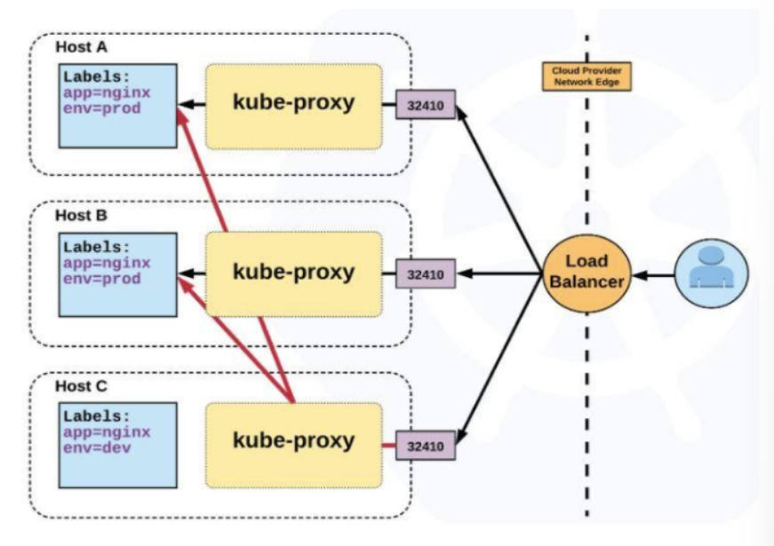

## Pods are ephemeral

Pods have a lifecycle and can very easily die. When a worker node dies, the Pods running on the Node are also lost. when a Pod crashes or is deleted and another one comes up with the help of a ReplicaSet, the new Pod has a different IP address from the terminated one. This makes the Pod IP address unstable which can result in application errors. However, managing a connection to a Pod with a Service creates a stable IP address to reach the Pod at.

## The idea of a Service

A Service in Kubernetes is an abstraction which defines a logical set of Pods and a policy by which to access them. Each Pod has a unique internal IP address that cannot be exposed outside of the cluster without a Service. Services allow your applications to receive traffic. In other words, a Service is a permanent ip address that can be attached to each pod. The lifecycle of the Service and the Pod are not connected.

There are five types of Services:

- **ClusterIP (default)** - Exposes the Service on an internal IP in the cluster. This type makes the Service only reachable from within the cluster.
- **NodePort** - Exposes the Service on the same port of each selected Node in the cluster using NAT. Makes a Service accessible from outside the cluster using <NodeIP>:<NodePort>. Superset of ClusterIP.
- **LoadBalancer** - Creates an external load balancer in the current cloud (if supported) and assigns a fixed, external IP to the Service. Superset of NodePort.
- **ExternalName** - Maps the Service to the contents of the externalName field (e.g. foo.bar.example.com), by returning a CNAME record with its value. No proxying of any kind is set up. This type requires v1.7 or higher of kube-dns, or CoreDNS version 0.0.8 or higher.
- **Headless** - Sometimes you don't need load-balancing and a single Service IP. In this case, you can create what are termed "headless" Services, by explicitly specifying "None" for the cluster IP (.spec.clusterIP).

## LoadBalancer Service
This Service type shares the client’s requests across the servers continuously, efficiently, and evenly to protect against the excessive usage of server resources.



Creating a load balancer Service can be done in two different ways, either internal or external. 

**The internal LoadBalancer**, which only has a private IP address on its node, is used to balance request traffic from clients within the same virtual network. 

**The external LoadBalancer**, on the other hand, has public IP addresses and it is used to balance external request traffic from clients outside the cluster. 

#### Step 1: Create Deployment
First, create a Deployment and make sure that the spec.selector.matchLabels.app value in the Deployment manifest file matches the spec.template.metadata.labels.app value in the same Deployment manifest as well as the spec.selector.app value in the Service manifest file. The manifest file will look like this:

``` YAML
apiVersion: apps/v1 
kind: Deployment 
metadata: 
 name: my-deployment 
spec: 
 replicas: 2 
 strategy: 
  type: Recreate 
 selector: 
  matchLabels: 
   app: my-app 
 template: 
   metadata: 
    labels: 
     app: my-app 
     env: prod 
   spec: 
    containers: 
    - name: my-deployment-container 
      image: nginx
   ``` 
Use `kubectl create` command to create the Deployment. 

This configuration will create a Deployment with two Pods that we will expose with a ClusterIP service. Once the Pods are running by checking it using `kubectl get pods` command, create a Service with the below configuration

#### Step 2 : Create YAML file
``` bash
$ vim LB_service.yaml
```
Copy and paste the below manifest file into your file, save, and exit:

``` YAML
apiVersion: v1
kind: Service
metadata:
 name: example-prod
spec:
 type: LoadBalancer
 selector:
  app: my-app
  env: prod
 ports:
 - protocol: TCP
   port: 80
   targetPort: 80
```
#### Step 3 : Deploy your Service to the cluster
``` bash
$ kubectl create -f LB_service.yaml

service/example-prod created
```
#### Step 4 : Check the status of the Service
``` bash
$ kubectl get service example-prod

NAME          TYPE          CLUSTER-IP              EXTERNAL-IP                               PORT(S)       AGE                           
example-prod  LoadBalancer  10.240.19.54  afe...61723.eu-central-1.elb.amazonaws.com          80:30592/TCP  15m 
```

#### Step 5: Find the created Service’s IP addres
Exec into one of the containers:
``` bash
Namespace:                default

Labels:                   &lt;none>

Annotations:              &lt;none>

Selector:                 app=my-app,env=prod

Type:                     LoadBalancer

IP:                       10.240.19.54

LoadBalancer Ingress:     xxx.xxx.xxx

Port:                     &lt;unset>  80/TCP

TargetPort:               80/TCP

NodePort:                 &lt;unset>  30592/TCP

Endpoints:                172.25.0.11:80,172.25.0.12:80

Session Affinity:         None

External Traffic Policy:  Cluster

Events:

   Type           Reason               Age          From                 Message

   ----           ------               ----         ----                 -------

   Normal    EnsuringLoadBalancer      21m     service-controller   Ensuring load balancer

   Normal    EnsuredLoadBalancer       20m     service-controller   Ensured load balancer
``` 
The IP address is listed in front of the LoadBalancer Ingress field marked with xx.xxx.xxx.

*Kubernetes official website: [Using a Service to Expose Your App](https://kubernetes.io/docs/tutorials/kubernetes-basics/expose/expose-intro/)*

*KUBERMATIC: [Exposing Apps With Services](https://www.kubermatic.com/blog/exposing-apps-with-services/)*

