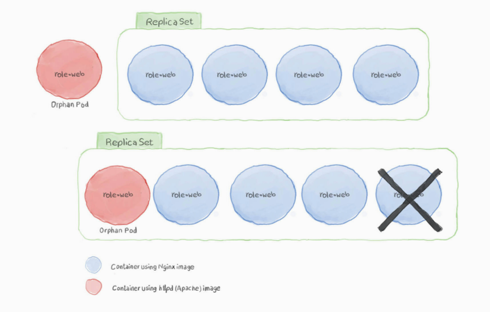

# Statefulsets 
## What is Statefulsets
A ReplicaSet is a process that runs multiple instances of a Pod and keeps the specified number of Pods constant. Its purpose is to maintain the specified number of Pod instances running in a cluster at any given time to prevent users from losing access to their application when a Pod fails or is inaccessible. 

In order for a ReplicaSet to work, it needs to know which pods it will manage so that it can restart the failing ones or kill the unneeded. It also requires understanding how to create new pods from scratch in case it needs to spawn new ones.
### How Statefulsets Works 
A ReplicaSet uses labels to match the pods that it will manage. It also needs to check whether the target pod is already managed by another controller When you create a pod with the same tag/label that matches the ReplicaSet you created, the ReplicaSet will have full control of it

Example of ReplicaSet manifest that use Nginx image

``` yaml
apiVersion: apps/v1
kind: ReplicaSet
metadata:
    name: web
    labels:
        web-app: front-end
spec:
    replicas: 3
    selector:
        matchLabels:
            web-app: front-end
    template:
        metadata:
            labels:
                web-app: front-end
        spec:
            containers:
            - name: nginx
              image: nginx
```
Create the ReplicaSet
``` Bash
justk8s@justk8s-master:~$kubectl apply -f replicaset.yaml
replicasets/web created

justk8s@justk8s-master:~$ kubectl get pods 

NAME        READY   STATUS              RESTARTS   AGE
web-gcwt4   0/1     ContainerCreating   0          10s
web-qdn7w   0/1     ContainerCreating   0          10s
web-wslvk   0/1     ContainerCreating   0          10s
```
### Scaling and Autoscaling ReplicaSets
You can Easily change the number of pods a particular ReplicaSet manages in one of two ways: 
 1. Edit the controller's configuration by using `kubectl edit rs ReplicaSet_name` and change the replicas count up or down as you desire 
 2. Use kubectl directly - for example, `kubectl scale --replicas=2 rs/web`. Here, we're scaling down the ReplicaSet web
<hr>
ReplicaSets can also be used to adapt the number of pods according to the node's CPU load. To enable autoscaling for our web ReplicaSet, we can use the following command:
``` bash
kubectl autoscale rs web --max=5
```
This will use the Horizontal Pod Autoscaler(HPA) with the ReplicaSet to increase the number of pods when the CPU load gets hight, but it should not exceed five pods. 

### What happen when i create another Pod with the same ReplicaSet selector

Lets Consider we have this pod manifest with a label that match the ReplicaSet selector. How will the controller adopt it.

``` yaml
apiVersion: v1
kind: Pod
metadata:
    name: orphan
    labels:
        web-app: front-end
spec:
    containers:
    - name: orphan
      image: httpd
```

#### Create the Pod After the ReplicaSet
Lets Assume that the previous ReplicaSet is working 

``` bash 
justk8s@justk8s-master:~$ kubectl get pods 

NAME        READY   STATUS              RESTARTS   AGE
web-gcwt4   1/1     Running             0          10m5s
web-qdn7w   1/1     Running             0          10m6s
web-wslvk   1/1     Running             0          10m8s
```
It looks a lot like the other pods, but is using Apache (httpd) instead of Nginx for an image. Using kubectl, we can apply this definition as: 
``` bash
justk8s@justk8s-master:~$ kubectl apply -f orphan.yaml
pod/orphan created
```
Give it a few moments for the image to get pulled, and the container is spawned, then run kubectl get pods. You should see the output looks like the following:
``` bash
justk8s@justk8s-master:~$ kubectl get pods 

NAME        READY   STATUS              RESTARTS   AGE
orphan      0/1     Terminating         0          1m
web-gcwt4   1/1     Running             0          25m
web-qdn7w   1/1     Running             0          25m
web-wslvk   1/1     Running             0          25m
```
The pod is being terminated by the ReplicaSet because the controller has more pods than it was configured to handle. So, it is killing the excess one.
<center>

<center>

#### Create the Pod Before the ReplicaSet
Lets assume that we don't have any ReplicaSet on our cluster and the our httpd pod is running. So we create the same Previous ReplicaSet.

``` bash
justk8s@justk8s-master:~$kubectl apply -f replicaset.yaml
replicasets/web created
```
The ReplicaSet won't terminate the httpd pod is that the latter gets created before the ReplicaSet does
Let's have a look at our pods status by running `kubectl get pods` :
``` bash
justk8s@justk8s-master:~$ kubectl get pods 

NAME        READY   STATUS              RESTARTS   AGE
orphan      1/1     Running             0          10m
web-bcdt5   1/1     Running             0          5m
web-uin9j   1/1     Running             0          5m
```
Now, The situation is that we have 2 pods running Nginx, and one pod running apache. The ReplicaSet is handling 3 pods
<center>

</center>

If the Apache pod fails or is deleted, the ReplicaSet would replace it with the Nginx pod, and everything will be okay as suspected

### Deleting ReplicaSets
As with other Kubernetes objects, a ReplicaSet can be deleted by issuing a kubectl command like the following:
``` bash
justk8s@justk8s-master:~$ kubectl delete rs <ReplicaSet_name> 
```
Alternatively, you can also use the file that was used to create the resource to delete all the resources defined in the file
``` bash
justk8s@justk8s-master:~$ kubectl delete -f <ReplicaSet.yaml> 
```